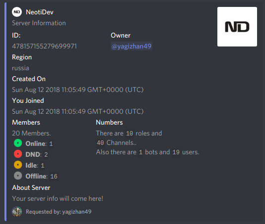

# aboutServer

## What is module **`aboutServer`**?

aboutServer module will let you edit _**`+serverinfo`**_ command.

### Example



### How do i edit it?

Just run the following command:

```text
+setabout <your unique text>
```


You're done!


