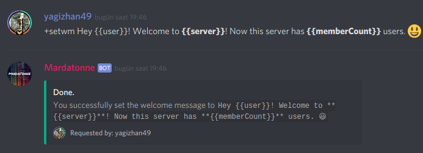
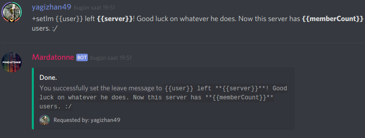

# Custom Welcome/Leave Messages

## _**`Welcomer`**_ module needs to be enabled!

This changes will only take effect if you have [welcomer](setting-up-welcomer.md) module enabled.

Please enable it first!



### Custom definitions

```text
{{user}}        : Username
{{server}}      : Server name
{{membercount}} : Server member count
```


You can include these in your message to get user/server's info


### How do i set messages?

#### Setting welcome message

Just run the following command:

```text
+setwm <custom welcome message>
```


Once you get the confirmation message, you're ok!




#### Setting leave message

Just run the following command:

```text
+setlm <custom leave message>
```


Once you get the confirmation message, you're ok!





