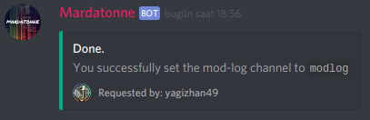

# Setting up mod-log

## What is module **`mod-log`**?

mod-log is a module which logs the actions such as `ban` and `kick`.

### When does it log?

* If someone uses `+ban` command.
* If someone uses `+kick` command

### How do i enable it?

Just run the following command:

```text
+setmodlog <mod-log channel name>
```


 Please note that bot needs to have the permissions to send messages to the mod-log channel.


Once you get the confirmation message, you're ok!




