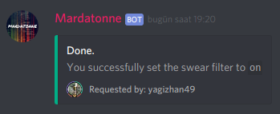

# swearFilter module

First, Please note that we just started building this feature.. So this can be marked as _**`BETA`**_

What i meant by _**`BETA`**_ is, it can catch some little swear words for now. We need a list of swearing words and it marks some normal messages as _**`NSFW.`**_

## What is module **`swearFilter`**?

swearFilter is a module which catchs and deletes messages if they contain bad words.

This will ignore bad messages from users who has _**`MANAGE_MESSAGES`**_ permission.

### How do i enable/disable it?

Just run the following command:

```text
+swearfilter <on/off>
```


 Please note that bot needs to have the permissions to delete messages.


Once you get the confirmation message, you're ok!




